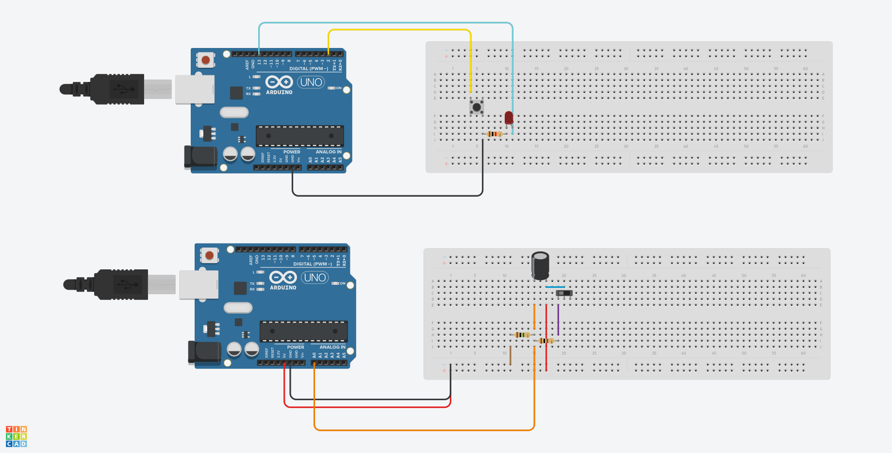

# Ponderada de Computação #2

## Marcos Vinicius Marcondes Silva

## Descrição

Nesta ponderada, utilizamos um citcuito RC para realizar o deboucing de um botão, abaixo podemos observar dois sistemas que utilizam botões, um que não utiliza capacitores e outro que utiliza

O segundo circuito (o que utiliza capacitores), contém o script presente em [`pond-comp-2.ino`](./pond-comp-2.ino), que printa no console o tempo de execução do programa, a tensão do capacitor e a tensão do resistor.

## Análise de dados

Para observar a transferêcia dos dados 
